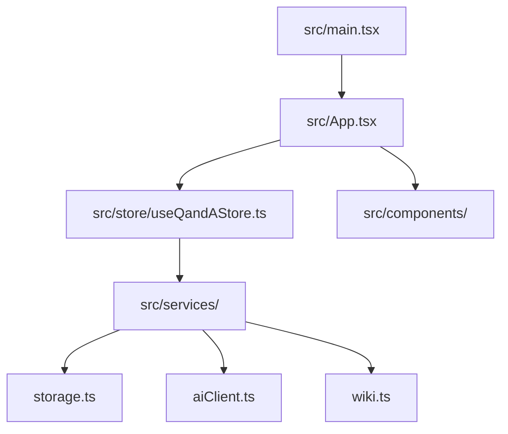

# Project Roadmap & Implementation Plan: KI-Lernassistent

This document outlines the developer plan and roadmap for expanding the AI-assisted tutor application. It divides the objectives into structured implementation phases with task lists.

---

## 🏗️ Architectural Overview
The project is built on React 19, TypeScript, Vite, Material UI (MUI), and Zustand. It currently interacts with a local Ollama instance running `gemma4:e4b`.

---

## 🎯 Phase 1: Code Restructuring & Bug Fixes
*Goal: Restructure the codebase into a clean, modular structure and resolve the grading display issue.*

### Tasks
- [x] **Fix the grading bug in [main.ts](file:///D:/Java%20Script/KI-Lernassistent/src/main.ts)**
  - Align spelling terms between the LLM system prompt explanation (`correctnes`/`completenes`) and the Zod schemas/UI parser keys (`correctness`/`completeness`).
  - Add spelling-tolerance fallbacks inside `getGrades` when parsing `parsedGraid`.
- [x] **Establish a modular folder structure**
  - Create directories: `src/components`, `src/services`, `src/store`, `src/types`.
- [x] **Refactor State & Actions**
  - Move state arrays (`questions`, `files`) and API logic out of [main.ts](file:///D:/Java%20Script/KI-Lernassistent/src/main.ts) and into a central Zustand store: `src/store/useQandAStore.ts`.
- [x] **Componentize the UI**
  - Split [main.tsx](file:///D:/Java%20Script/KI-Lernassistent/src/main.tsx) into focused component files:
    - `src/components/FileMenu.tsx` (Handles file uploads and menu toggling).
    - `src/components/AnswerBar.tsx` (Handles user input form).
    - `src/components/CurrentQuestion.tsx` (Displays loaded question or error states).
    - `src/components/AnswersContainer.tsx` (Displays list of questions, answers, and grades).
- [x] **Restore [App.tsx](file:///D:/Java%20Script/KI-Lernassistent/src/App.tsx) as Entry Layout**
  - Strip the default Vite template out of [App.tsx](file:///D:/Java%20Script/KI-Lernassistent/src/App.tsx).
  - Use it as the primary layout shell hosting the subcomponents.
  - Simplify [main.tsx](file:///D:/Java%20Script/KI-Lernassistent/src/main.tsx) to only render `<App />` inside the React root.

---

## 💾 Phase 2: Browser Data Persistence
*Goal: Implement data saving to prevent data loss on page refreshes.*

### Tasks
- [x] **Select a storage strategy**
  - Use `localStorage` for questions metadata, prompt preferences, and configuration parameters.
  - Use `IndexedDB` (or serialised string storage in `localStorage` for smaller documents) to persist raw uploaded document contents.
- [x] **Design storage schemas**
  - Structure saved data to mirror Zustand store states.
- [x] **Integrate persistence layer with Zustand**
  - Save to local storage on store modifications (middleware or manual subscription).
  - Hydrate Zustand state during application initialization (`useEffect` in [App.tsx](file:///D:/Java%20Script/KI-Lernassistent/src/App.tsx)).

---

## ⚙️ Phase 3: AI Prompt & Generation Customization
*Goal: Enable users to guide the question generation process and customize internal system prompts.*

### Tasks
- [x] **Add Case-Specific Instructions UI**
  - Introduce an input field or text area (e.g. "Guidelines") in the main layout.
  - Example options: *"Ask only multiple-choice questions"*, *"Ask in German"*, *"Focus on definitions"*.
- [x] **Dynamically inject instructions into generation prompt**
  - Pass the custom user instructions string to the Ollama payload in the `system` or `prompt` body.
- [x] **Add System Prompt Editor panel**
  - Create a developer configuration dialog or settings page.
  - Expose default generation and grading prompts to the user.
  - Support saving overridden prompts to persistent browser storage.

---

## 🌐 Phase 4: Multiple LLM APIs & Wikipedia Integration
*Goal: Support commercial LLM providers and allow importing study materials directly from Wikipedia.*

### Tasks
- [x] **Build a generic AI Client interface**
  - Standardize LLM request/response payloads behind a unified interface (`src/services/aiClient.ts`).
- [x] **Integrate commercial LLM APIs**
  - **OpenAI (ChatGPT)**: Add fetch service matching the Chat Completions endpoint.
  - **Anthropic (Claude)**: Add fetch service matching the Messages API endpoint.
  - **Google (Gemini)**: Add fetch service matching the Google AI Developer API.
  - Create a settings panel for provider/model selection and API key management (stored locally in-browser).
- [x] **Implement Wikipedia Search and Import**
  - Add a search input field for Wikipedia topics.
  - Use the Wikipedia query API (`https://en.wikipedia.org/w/api.php`) to retrieve page summary or full text content.
  - Format the response into text/markdown and automatically append it to the active documents list, enabling immediate question generation.
